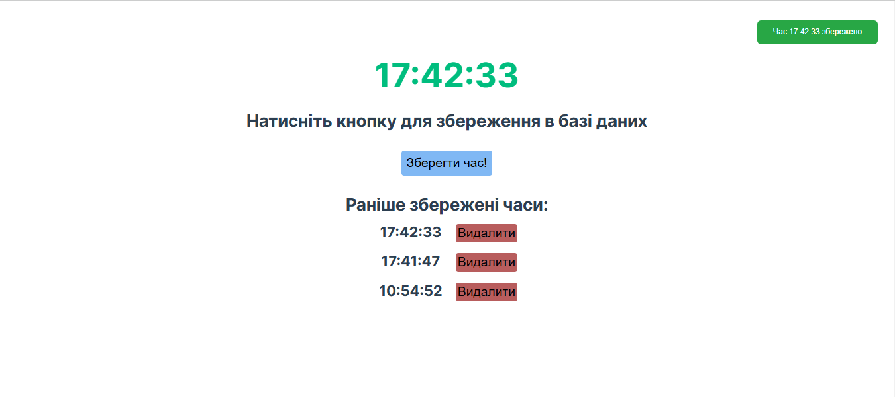

## Preview of the Application

Below is a preview of the time-saving application:



# Project Setup Guide

This project consists of four services:

1. **Frontend**: A web application without the `node_modules` folder. ✨
2. **API**: Backend service without the `node_modules` folder. ⚙️
3. **Database (MySQL)**: Configured via `docker-compose.yml`. 🗄️
4. **Adminer**: A web-based database management tool configured via `docker-compose.yml`. 🛠️

The services are orchestrated using Docker Compose. Follow the steps below to start all services locally using Docker Desktop. 🚀

## Prerequisites

1. Install [Docker Desktop](https://www.docker.com/products/docker-desktop). 🐳
2. Ensure Docker Compose is installed (it comes bundled with Docker Desktop). ✅
3. Clone the project repository to your local machine. 📂
4. Navigate to the root directory of the project. 📁

> **Note**: The `node_modules` folder is not required when using Docker Compose on Docker Desktop. The volumes specified in the `docker-compose.yml` file handle dependencies inside the containers. 🛠️

## Steps to Start the Services

### 1. Build and Start Services

Run the following command from the project root directory:

```bash
docker-compose up --build
```

This command will:

- Build the `frontend` and `api` services from their respective directories. 🏗️
- Start the `mysql` database and wait until it is healthy. 🏥
- Start the `adminer` service for database management. 🖥️

### 2. Access the Services

- **Frontend**: Open your browser and go to [http://localhost:3000](http://localhost:3000). 🌐
- **API**: Accessible at [http://localhost:5555](http://localhost:5555). 🔌
- **Adminer**: Open [http://localhost:8080](http://localhost:8080). Use the following credentials:
  - Server: `mysql`
  - Username: `root`
  - Password: `password`
  - Database: `time_db`

### 3. Stop the Services

To stop the services, press `Ctrl+C` in the terminal where the `docker-compose` command is running. Then, run:

```bash
docker-compose down
```

This command stops and removes the containers but retains the MySQL data in the volume. 📦

## Troubleshooting

1. **Node Modules Not Found**:
   Ensure the `node_modules` directories are excluded as specified in the `volumes` section of `docker-compose.yml`. 🛠️

2. **MySQL Health Check Fails**:
   Verify that the MySQL service has sufficient time to initialize. Check logs with:

   ```bash
   docker-compose logs mysql
   ```

3. **Ports Already in Use**:
   Stop any processes using the required ports (3000, 5555, 8080, 3306). Use the following command to identify such processes:

   ```bash
   lsof -i :<PORT>
   ```

   Replace `<PORT>` with the specific port number and stop the conflicting process. 🔍

4. **Rebuilding Services**:
   If you make changes to the code, rebuild the services with:
   ```bash
   docker-compose up --build
   ```

## Additional Notes

- The `mysql_data` volume is used to persist database data. If you wish to reset the database, remove this volume:
  ````bash
  docker-compose down -v
  ``` 🔄
  ````
